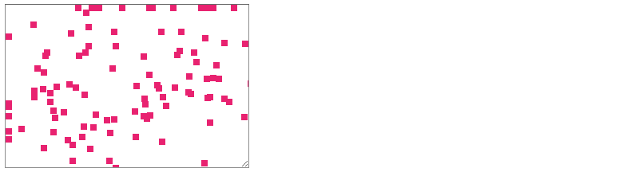

### Houdini Experiments

This is a little library of [CSS Houdini](https://developer.mozilla.org/en-US/docs/Web/Houdini) Paint API experiments. The Houdini Paint API allows developers to create custom CSS classes that render a HTML5 Canvas background on HTML5 elements. The custom CSS classes, can be developed with CSS attributes that can be set like 'normal' CSS attributes.

These experiments were inspired by a desire to put together some data visualizations using a confetti animation for another project.

#### Getting Started

This project plays with the CSS Houdini Paint API you can read more about it [here](https://developer.mozilla.org/en-US/docs/Web/Houdini).

The CSS Houdini specifications are only beginning to be adopted by web browsers. I tested my work with the latest versions of Chrome ( version 77 as I write this ).

#### Prerequisites

This project uses [Node JS](https://nodejs.org/en/download/) as a run time environment.

#### Installing

Assuming you have Node JS installed. Clone this repo, and cd into the folder you've cloned. You should see a file there called app.js

type:

```
npm install
```

when the node dependencies have installed

```
node app
```

You should see some output like this:

```
server starting on http://localhost:3000
```

#### Running

This app is really basic - you should see a resizeable text area with random red colored confetti floing through it. This is CSS Houdini at work. You can stretch the box, and the conffeti should continue to fill it.



#### Overview

The node app you may have run from the install instuctions is a really simple little Express JS app - that just serves a public folder. You can see what's in the public folder by taking a look in the 'public' folder.

There are four files:

index.html is just a placeholder for the textarea, but has a css class associated with it called 'bar'

confetti.css defines the 'bar' class ...

```
.bar {
    background-image: paint(confettiarea);
  --confettiColor:#E1297D;
  --confettiLimit:100;
  --confettiSize:8;
  --movement:0;
  width: 300px;
  height: 200px;
}
```
And you can see the custom css attributes inside it for defining the color, size, and amount of confetti in there.

CSS Houdini paint API uses HTML5 Canvas JS instructions for drawing. You can see how it draws with Canvas notation in the the confetti.js file.

You can see that the confetti are animated ... but Houdini paint doesn't support animation. I'm cheating. The Houdini paint API redraws whenever a custom CSS attribute changes, so I'm running an animation loop outside of the paint area in logic.js, by just changing the value of 'movement' each time. logic.js is also where the paint 'worklet' is instantiated.

I hope to provide a more static example shortly.

In the 'canvas' folder, you can see where I groomed the basic HTML5 canvas code in a standard javascript way, before porting it to a Houdini rendering class.
